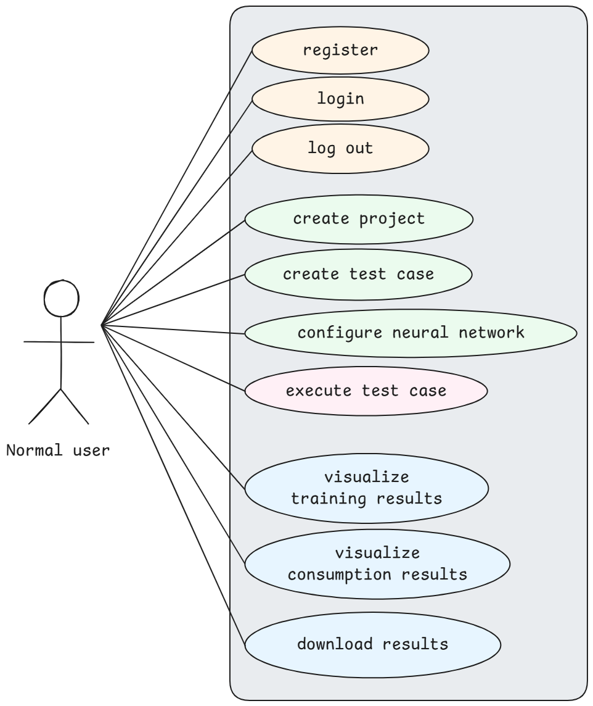
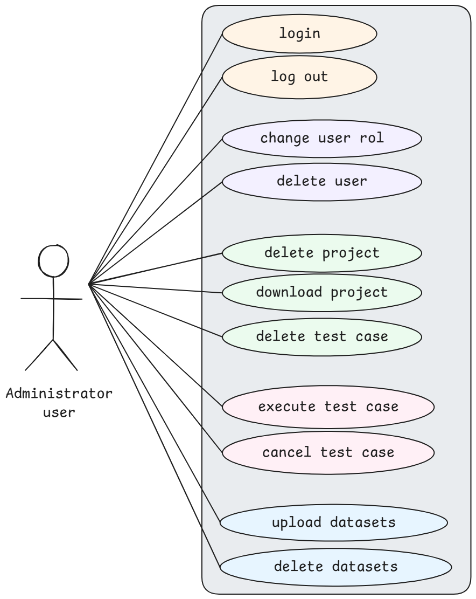

# granular-energy-eval-NN
> This repository contains anonymized materials (code, data, etc.) related to a submission currently under double-blind review.

## Overview
This repository contains the code and supplementary material for a paper title:

**"GREENN: Granular Evaluation of Energy Efficiency in Neural Networks"**

## Abstract

In recent years, the use of Artificial Intelligence (AI) has experienced exponential growth. However, this development has also raised a new concern: the high energy consumption associated with the life cycle of its models and their environmental impact. Deep learning and, in particular, convolutional networks, are among the models that consume the most computational resources during their training.

To address this challenge, we present GREENN (Granular Evaluation of Energy Efficiency in
Neural Networks), a tool designed to help users understand the energy behavior of their neural networks and choose the most appropriate architecture for their specific problem, thus achieving a balance between performance and energy consumption. To achieve this, GREENN measures and analyzes energy consumption during training at different levels of granularity: (i) taking into account the overall training process, (ii) breaking down the results for each *epoch* or (iii) for each of the layers of the neural network. Along with the energy consumed by each hardware component of the computer and carbon emissions generated, GREENN also reports the model performance results using metrics such as *accuracy* and *F1-score*.

## Repository Structure

TODO

----

## GREENN's Development Planning

The development of GREENN followed a structured planning process, which is detailed below. Following the iterative and incremental approach of **Scrum** and **OpenUP**, a set of **User Stories (US)** were defined.  
These [stories](user_stories.md) were organized into the **Product Backlog**, then prioritized and distributed across sprints, enabling effective iteration planning.

### Use Case Model

Once the functional requirements were defined, **Use Case Diagrams (UCDs)** were developed to visualize the complete system functionality and how the different actors interact with the tool. There are two main actors: the **User** (see [User UCD Diagram](#user-use-case-diagram)), who interacts with the system to evaluate neural networks, and the **Administrator** (see [Admin UCD Diagram](#admin-use-case-diagram)), who manages the system's configurations and user access.

### Development Plan

Table **Product Backlog** presents the product stack, where the work required to complete the project milestones was divided into sprints. In each sprint, a functional increment of the application was developed, following an iterative and incremental approach.  

#### Product Backlog

| **ID**  | **Description** |
|:------- |:----------------|
| **M1**  | Acquisition of foundational knowledge. |
| **M2**  | Identification of the main functionalities. |
|         |          |
| **M3**  | Design of the use case model. |
| **M4**  | Design of the system architecture. |
| **M5**  | Design of the user interface. |
| **M6**  | Configuration of the development environment. |
|         |          |
| **M7**  | Creation of the neural network module. |
| **M8**  | Implementation of the module for energy consumption measurement. |
| **M9**  | Development of the module for configuring a case study from a file. |
| **M10** | Implementation of the backend application handling business logic. |
| **M11** | Development of the web interface of the application. |
| **M12** | Implementation of the report generation module within the Python package. |
| **M13** | Development of the administration dashboard. |
|         |          |
| **M14** | Functional validation of the complete system. |
| **M15** | Preparation of the user manual. |
