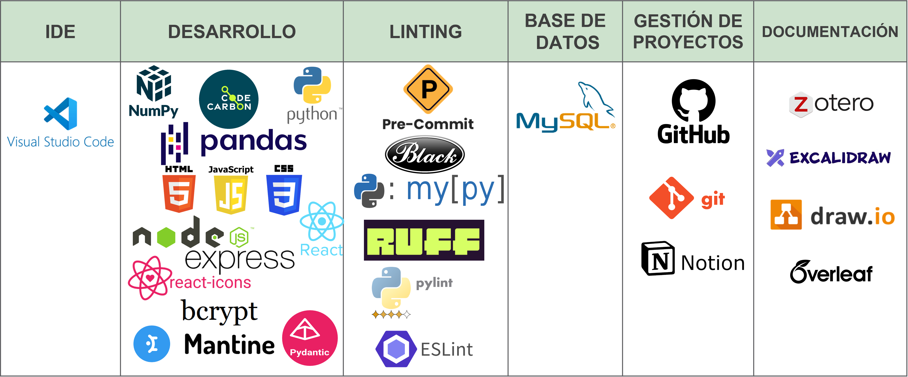
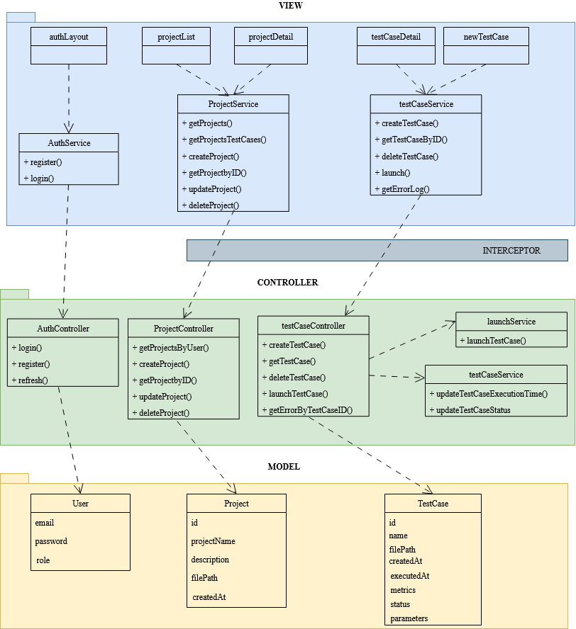
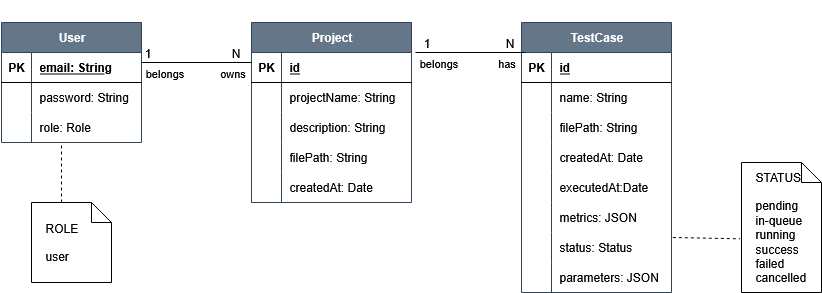
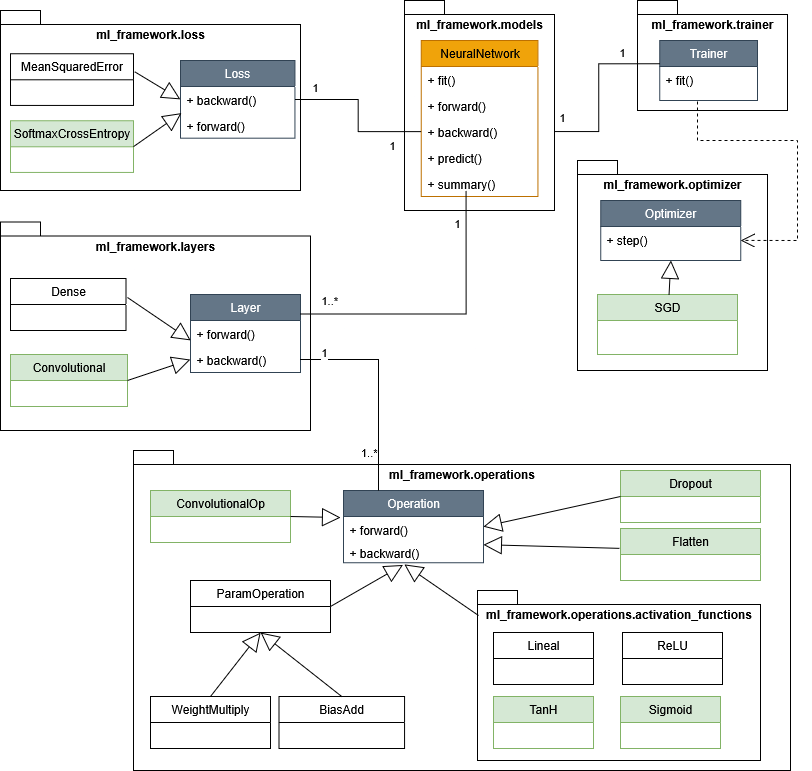
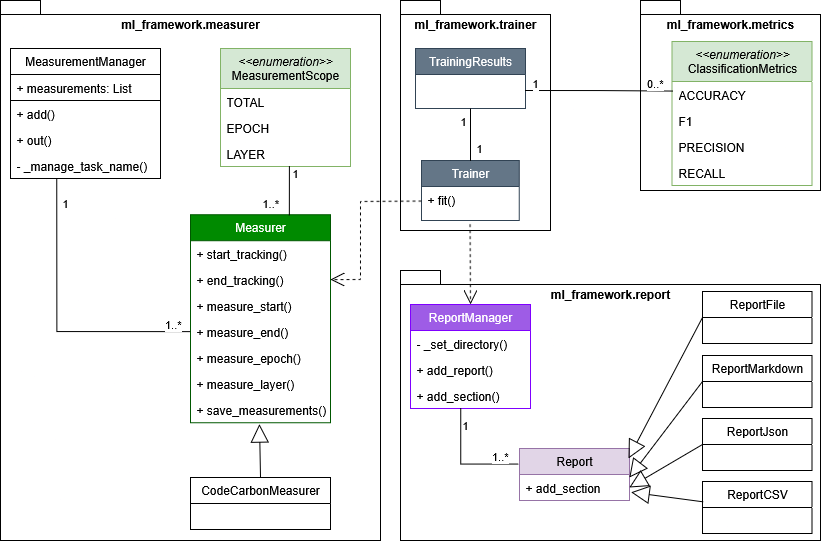
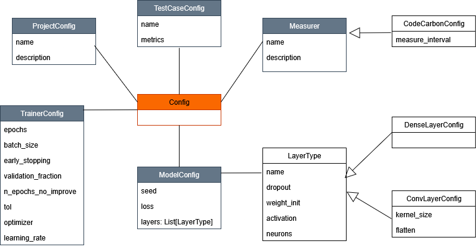

# Architecture Overview

This document provides a comprehensive overview of the architecture of the GREENN tool, detailing its main components, their interactions, and the technologies employed in its development.

## Technologies Used
The following image illustrates the most relevant technologies used in the development of GREENN.

## System Architecture

## MVC Architecture

The architecture of GREENN is based on the Model-View-Controller (MVC) design pattern, which separates the application into three interconnected components. This separation allows for efficient code organization, easier maintenance, and scalability.

The following image illustrates the database schema used in GREENN, detailing the structure of the tables and their relationships.

## Python Package Architecture

The core of GREENN is implemented as a Python package, which encapsulates the main functionalities of the tool related to neural network evaluation and energy consumption measurement. The package is structured into several modules, each responsible for a specific aspect of the tool's functionality.

- [Neural Network Module](#neural-network-module-diagram)
- [Energy Measurement Module](#energy-measurement-module-diagram)
- [Configuration File Example Module](#configuration-file-example-diagram)

Additionally, an example of a configuration file is provided in 'config_example.json', which demonstrates how to set up manually a test case. 